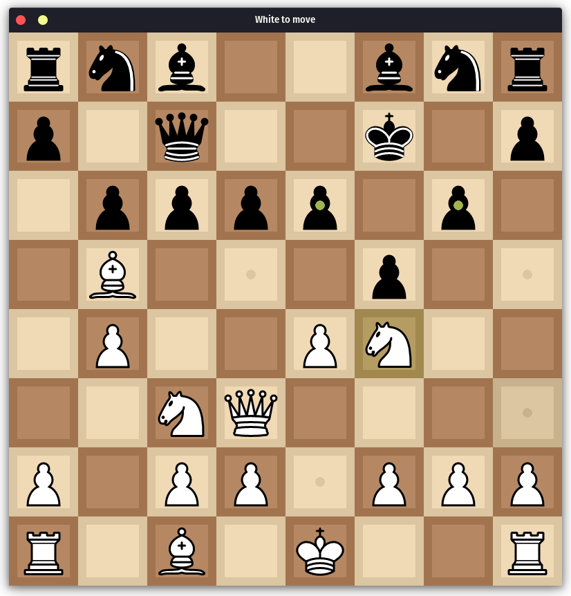

# Chess
A simple, nice-feeling chess implementation in python using pygame.

## Features
* Complete legal move set (en passant, pawn promotion, and castling included).
* Easily configurable so you can make it look however you want.
* Player vs. Player and Player vs. Random modes available (Player vs. Stockfish mode planned for V2.)
* Crisp graphics and satisfying sound effects.
* Cross-platform support with easy installation.
* Straightforward and simple interface, with no unneccesary clutter.

## Backend
* Written entirely in Python with the [pygame](https://www.pygame.org/wiki/about) library.
* Board state stored as an 8×8 array of strings.
* Move validation handled by per-piece movement logic.
* Game loop runs at 60 FPS (customizable)
* Most assets and constants are loaded, not hardcoded, so as to make modding as easy as possible.

## Screenshot Gallery
<p>
  
  
</p>
<p>
  
  
</p>

## Installation (Via Git)
```bash
git clone https://github.com/Elliptical52/Chess.git
cd projectname
pip install -r requirements.txt
python main.py
```

## Customization
* Sounds can be changed in the sounds directory
* Pieces can be changed in the pieces directory
* If you use a different file format than the default, update the file format in config.py
* Make sure new files have the same name as old ones 
* Any constants in config.py can be changed


## Credits
• Chess piece graphics by Cburnett – CC BY-SA 3.0  
    https://creativecommons.org/licenses/by-sa/3.0/

• Chess sounds from Lichess.org – CC0  
    https://creativecommons.org/publicdomain/zero/1.0/
