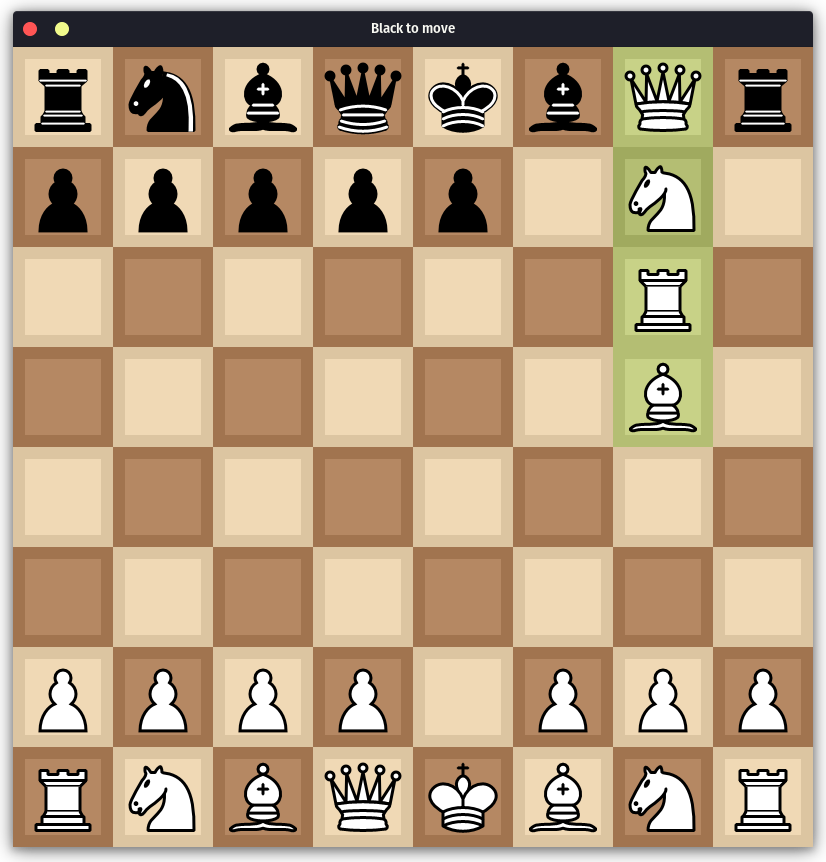

# Chess
A simple, nice-feeling chess implementation in python using pygame.

## Features
* Complete legal move set including en passant, pawn promotion, and castling
* Easily configurable to look and feel how you want
* Player vs. Player and Player vs. Random modes available (Player vs. Stockfish mode planned for V2.)
* Satisfying graphics and sound effects
* Easy to install and supports nearly every platform
* Straightforward and simple- only neccesary UI included

## Screenshot Gallery




## Installation (Via Git)
```bash
git clone https://github.com/username/projectname.git
cd projectname
pip install -r requirements.txt
python main.py
```

## Assets
• Chess piece graphics by Cburnett – Licensed under CC BY-SA 3.0
  https://creativecommons.org/licenses/by-sa/3.0/

• Chess sounds from Lichess.org – Licensed under CC0
  https://creativecommons.org/publicdomain/zero/1.0/

• Board color palette inspired by Lichess.org – AGPLv3
  https://www.gnu.org/licenses/agpl-3.0/
